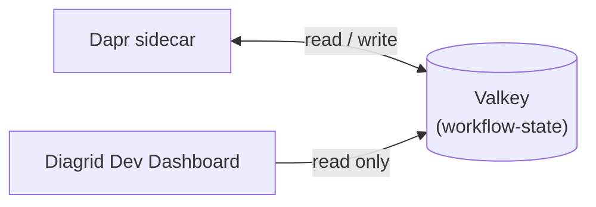

In this challenge you'll wire up the infrastructure that Dapr Workflow and the Diagrid Dev Dashboard need to run. You'll author two Dapr state store component files, make sure they ship to the output directory, and update the AppHost so Aspire orchestrates Valkey, the Dapr sidecar, the dashboard, and the API service together.

There are two Dapr component files required under the AppHost project:

1. A Dapr state store component that is used by Dapr Workflow
2. A Dapr state store component that is used by the Diagrid Dev Dashboard

Both files point to the same state store (Valkey) but require a different value for `redisHost` due to networking.

The diagram below shows how the Dapr sidecar and the Diagrid Dev Dashboard each connect to the same Valkey state store. The Dapr sidecar reads and writes workflow state, while the Diagrid Dev Dashboard only reads from the state store to visualize it.



Ensure that the *Terminal* path is currently in `EnterpriseDiagnostics/`.

## 1. `Resources/dapr/workflow-state.yaml`

Let's create the component file used by Dapr to store workflow state. This will be the location of the file: `Resources/dapr/workflow-state.yaml`.

1. Create the folders and the empty yaml file using the *Terminal*:

```shell,run,copy
mkdir EnterpriseDiagnostics.AppHost/Resources/
mkdir EnterpriseDiagnostics.AppHost/Resources/dapr
touch EnterpriseDiagnostics.AppHost/Resources/dapr/workflow-state.yaml
```

2. Refresh the *Editor* window to see the new file.
3. Update the content of the empty file using the *Editor* window:

```yaml,copy
apiVersion: dapr.io/v1alpha1
kind: Component
metadata:
  name: workflow-state
spec:
  type: state.redis
  version: v1
  metadata:
    - name: redisHost
      value: "localhost:6379"
    - name: redisPassword
      value: ""
    - name: actorStateStore
      value: true
```

## 2. `Resources/dapr/diagrid-dashboard-components/diagrid-dashboard-state.yaml`

The Diagrid Dev Dashboard requires a connection to the statestore that is based on a Dapr component file. The default location for the Diagrid Dev Dashboard Aspire integration is `Resources/dapr/diagrid-dashboard-components` in the AppHost project.

1. Create the folder and yaml file using the *Terminal*:

```shell,run,copy
mkdir EnterpriseDiagnostics.AppHost/Resources/dapr/diagrid-dashboard-components
touch EnterpriseDiagnostics.AppHost/Resources/dapr/diagrid-dashboard-components/diagrid-dashboard-state.yaml
```

2. Refresh the *Editor* window to see the new file.
3. Copy the following component spec in the empty file using the *Editor* window:

```yaml,copy
apiVersion: dapr.io/v1alpha1
kind: Component
metadata:
  name: diagrid-dashboard-store
scopes:
  - diagrid-dashboard
spec:
  type: state.redis
  version: v1
  metadata:
    - name: redisHost
      value: "172.17.0.1:16379"
    - name: redisPassword
      value: ""
    - name: actorStateStore
      value: true
```

## 3. Update `EnterpriseDiagnostics.AppHost.csproj`

The two Dapr component files in the Resources folder need to be available when the Aspire solution runs.

Add a `Content` item group so the component files are copied to the output directory. Use the *Editor* window to add the item group to the `EnterpriseDiagnostics.AppHost.csproj` file:

```xml,copy
  <ItemGroup>
    <Content Include="Resources\**\*.*">
      <CopyToOutputDirectory>PreserveNewest</CopyToOutputDirectory>
      <Link>Resources\%(RecursiveDir)%(Filename)%(Extension)</Link>
    </Content>
  </ItemGroup>
```

## 4. Replace `AppHost.cs`

Replace the contents of `EnterpriseDiagnostics.AppHost/AppHost.cs` with the following:

```csharp,copy
using System.Reflection;
using CommunityToolkit.Aspire.Hosting.Dapr;
using Diagrid.Aspire.Hosting.Dashboard;

var builder = DistributedApplication.CreateBuilder(args);

builder.AddDapr();

string executingPath = Path.GetDirectoryName(Assembly.GetExecutingAssembly().Location)
    ?? throw new("Where am I?");

var apiService = builder
    .AddProject<Projects.EnterpriseDiagnostics_ApiService>("apiservice")
    .WithHttpEndpoint(port: 5411, name: "http")
    .WithDaprSidecar(new DaprSidecarOptions
    {
        LogLevel = "debug",
        ResourcesPaths =
        [
            Path.Join(executingPath, "Resources", "dapr"),
        ],
    });

apiService.WaitFor(cache);
builder.AddDiagridDashboard(configuration: new DiagridDashboardConfiguration
{
    Port = 18080,
});

builder.Build().Run();
```

## 5. Verify

Use the *Terminal* to build the solution:

```shell,run,copy
dotnet build
```

---

The AppHost now starts Valkey as the workflow state store, runs the API service with a Dapr sidecar that picks up the Dapr component files, and exposes the Diagrid Dev Dashboard alongside it. let's move on to the next challenge to run the solution, start the workflow, and inspect the workflow state using the local Diagrid Dev Dashboard.
