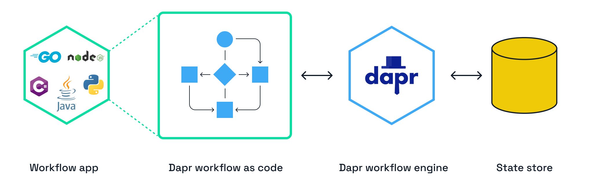

# Durable Execution

In this challenge, you'll learn about durable execution, how they relate to workflow engines, and how Dapr supports workflow as code.

## 1. What is durable execution

IT systems are failing all the time, and it's unrealistic to think all systems are available 100%. When developing distributed applications, you need to consider how to handle failures and retries. Ideally, systems should handle failure gracefully and get back to a healthy state automatically. This is where the durable execution concept comes in.

Durable execution guarantees that code is run to completion even if the process that runs the code terminates. Durable execution ensures another process is started, and the code is resumed until it completes successfully. This is realized by persisting the state of the execution to a state store.

Basically, durable execution means running your code in a stateful way so it can be recovered if the process crashes.

## 2. Workflow engines

For many decades, business processes have been automated using workflow systems. These systems consist of a workflow authoring environment where business processes are defined by a business user or developer, and a workflow engine that executes these processes. The workflow engine is responsible for managing the state of the workflow, executing the individual tasks (activities) that make up the workflow, and handling errors. So workflow engines are tools that implement durable execution.

Workflows are great to handle long-running processes, such as order processing that involves orchestration across multiple services, HR onboarding workflows that span multiple departments, approval workflows involving multiple stakeholders, or workflows to orchestrate the roll-out of updates for digital devices.

Many workflow systems use a visual workflow authoring environment. While these authoring tools are useful to visualize the workflow, they are not always convenient for developers to use. More recent workflow systems allow workflows to be authored in code.

## 3. Workflow as code

Authoring workflows in code allows developers to use the same tools and processes they are already familiar with. When workflows are part of the application code, they can be versioned in git and unit tested easily.

[Dapr Workflow](https://docs.dapr.io/developing-applications/building-blocks/workflow/workflow-overview/) offers a workflow engine that is part of the Dapr runtime. Dapr workflows are authored in code using the Dapr SDK and can be written in multiple languages:

- .NET
- Java
- Python
- JavaScript
- Go

> [!NOTE]
> This Dapr University track currently offers .NET example applications. Other languages will be added in the next couple of weeks.

Your application that contains the workflow code communicates with the Dapr workflow engine via the Dapr API. The Dapr workflow engine is responsible for scheduling the workflow and its activities, managing the state of the workflow, and handling errors and retries.

---

You now know what durable execution is, that workflow engines implement this concept, and Dapr offers workflow as code. Let's continue and take a look at a code example of a Dapr workflow and how to run it.