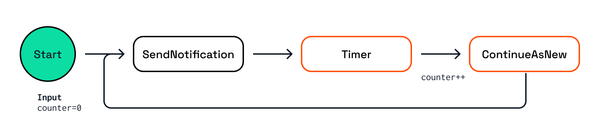

# Workflow Management

In this challenge, you'll explore the Dapr Workflow Management API and test the various operations that can be performed on workflow instances.

## 1. Workflow Management

The operations you'll be testing in this challenge besides starting a workflow and getting the status are:

- Suspend a workflow instance
- Resume a workflow instance
- Terminate a workflow instance
- Purge a workflow instance

The workflow used in this challenge is called `NeverEndingWorkflow` and it runs indefinitely. The workflow:

- Is started with an integer input named `counter` with value `0`.
- Calls a `SendNotification` activity.
- User a timer to wait for 1 second.
- Increments the `counter` by `1` 
- Continues as a new workflow instance.



### 1.1 Choose a language tab

Use one of the language tabs to navigate to the workflow management example. Each language tab contains a workflow application, and a Multi-App Run `dapr.yaml` file that is used to run the example.

### 1.2 Inspect the Workflow code

> [!NOTE]
> Expand the language-specific instructions to learn more about the workflow.

<details>
   <summary><b>.NET workflow code</b></summary>

Open the `NeverEndingWorkflow.cs` file located in the `WorkflowManagement` folder. This file contains the workflow code.

The input for this workflow is an integer, and gets incremented by `1` every second. The workflow will run indefinitely.

</details>

### 1.3 Inspect the Activity code

<details>
   <summary><b>.NET activity code</b></summary>

Open the `SendNotification.cs` file located in the `WorkflowManagement/Activities` folder. This activity only logs the activity input (the counter) and returns true.

</details>

### 1.4. Inspect the workflow & activity registration

> [!NOTE]
> Expand the language-specific instructions to learn more about workflow registration.

<details>
   <summary><b>.NET registration and endpoints</b></summary>

Locate the `Program.cs` file in the `WorkflowManagement` folder. This file contains the code to register the workflows and activities using the `AddDaprWorkflow()` extension method.

The application has the following HTTP endpoints:

- `start/{counter}`, a POST endpoint that is used to start the workflow, and accepts an integer as the input.
- `status/{instanceId}`, a GET endpoint that is used to get the status of the workflow instance, and accepts a workflow instance ID as the input.
- `suspend/{instanceId}`, a POST endpoint that is used to suspend the workflow instance, and accepts a workflow instance ID as the input.
- `resume/{instanceId}`, a POST endpoint that is used to resume a suspended workflow instance, and accepts a workflow instance ID as the input.
- `terminate/{instanceId}`, a POST endpoint that is used to terminate the workflow instance, and accepts a workflow instance ID as the input.
- `purge/{instanceId}`, a DELETE endpoint that is used to delete the workflow instance, and accepts a workflow instance ID as the input.

All methods use the `DaprWorklowClient` to perform the workflow management operations.

</details>

## 2. Run the workflow app

> [!NOTE]
> Expand the language-specific instructions to start the workflow management application.

<details>
   <summary><b>Run the .NET application</b></summary>

Use the **Dapr CLI** window to run the commands.

Navigate to the *csharp/workflow-management* folder:

```bash,run
cd csharp/workflow-management
```

Install the dependencies and build the project and build the project and build the project and build the project:

```bash,run
dotnet build WorkflowManagement
```

Run the application using the Dapr CLI:

```bash,run
dapr run -f .
```

</details>

Inspect the output of the **Dapr CLI** window. Wait until the application is running before continuing.

## 3. Start the workflow

Use the **curl** window to make a POST request to the `start` endpoint of the workflow application.

> [!NOTE]
> Expand the language-specific instructions to start the never ending workflow.

<details>
   <summary><b>Start the .NET workflow</b></summary>

In the **curl** window, run the following command to start the workflow:

```curl,run
curl -i --request POST \
  --url http://localhost:5262/start/0
```

Expected output:

```text
HTTP/1.1 202 Accepted
Content-Length: 0
Date: Wed, 23 Apr 2025 15:48:10 GMT
Server: Kestrel
Location: 71007295959944fd8d05dad5d4526806
```

The **Dapr CLI** window should contain these application log statements:

```text
== APP - neverendingworkflow == SendNotification: Received input: 0.
== APP - neverendingworkflow == SendNotification: Received input: 1.
== APP - neverendingworkflow == SendNotification: Received input: 2.
== APP - neverendingworkflow == SendNotification: Received input: 3.
...
```

</details>

## 4. Get the workflow status

Use the **curl** window to perform a GET request to the `status` endpoint of the application to retrieve the workflow status.

> [!NOTE]
> Expand the language-specific instructions to get the workflow instance status.

<details>
   <summary><b>Get the .NET workflow status</b></summary>

Use the **curl** window to perform a GET request to the `status` endpoint of the application to retrieve the workflow status:

```curl
curl --request GET --url http://localhost:5262/status/<INSTANCEID>
```

Where `<INSTANCEID>` is the workflow instance ID you received in the `Location` header in the previous step.

Expected output:

```json
{
   "exists":true,
   "isWorkflowRunning":true,
   "isWorkflowCompleted":false,
   "createdAt":"2025-04-23T15:51:43.0005152+00:00",
   "lastUpdatedAt":"2025-04-23T15:51:43.0114001+00:00",
   "runtimeStatus":0,
   "failureDetails":null}
```

</details>

## 5. Suspend the workflow

Use the **curl** window to make a POST request to the `suspend` endpoint of the application to suspend the workflow instance.

> [!NOTE]
> Expand the language-specific instructions to suspend the workflow instance.

<details>
   <summary><b>Suspend the .NET workflow</b></summary>

Use the **curl** window to make a POST request to the `suspend` endpoint of the application to suspend the workflow instance:

```curl
curl -i --request POST \
  --url http://localhost:5262/suspend/<INSTANCEID>
```

Where `<INSTANCEID>` is the workflow instance ID you received in the `Location` header in step 3.

Expected output:

```json
HTTP/1.1 202 Accepted
Content-Length: 0
Date: Wed, 23 Apr 2025 15:54:08 GMT
Server: Kestrel
```

> [!NOTE]
> The workflow instance has stopped executing. The **Dapr CLI** window should not show any new log statements.

</details>

## 6. Resume the workflow

Use the **curl** window to make a POST request to the `resume` endpoint of the application to resume the suspended the workflow instance.

> [!NOTE]
> Expand the language-specific instructions to resume the workflow instance.

<details>
   <summary><b>Resume the .NET workflow</b></summary>

Use the **curl** window to make a POST request to the `resume` endpoint of the application to resume the suspended the workflow instance:

```curl
curl -i --request POST \
  --url http://localhost:5262/resume/<INSTANCEID>
```

Where `<INSTANCEID>` is the workflow instance ID you received in the `Location` header in step 3.

Expected output:

```json
HTTP/1.1 202 Accepted
Content-Length: 0
Date: Wed, 23 Apr 2025 15:59:17 GMT
Server: Kestrel
```

</details>

## 7. Terminate the workflow

Use the **curl** window to make a POST request to the `terminate` endpoint of the application to terminate the running workflow instance.

> [!NOTE]
> Expand the language-specific instructions to terminate the workflow instance.

<details>
   <summary><b>Terminate the .NET workflow</b></summary>

Use the **curl** window to make a POST request to the `terminate` endpoint of the application to terminate the running workflow instance:

```curl
curl -i --request POST \
  --url http://localhost:5262/terminate/<INSTANCEID>
```

Where `<INSTANCEID>` is the workflow instance ID you received in the `Location` header in step 3.

Expected output:

```json
HTTP/1.1 202 Accepted
Content-Length: 0
Date: Wed, 23 Apr 2025 15:59:17 GMT
Server: Kestrel
```

The **Dapr CLI** window should show a log statement about the workflow being terminated:

```text
Workflow Actor <INSTANCEID>: workflow completed with status 'ORCHESTRATION_STATUS_TERMINATED' workflowName 'NeverEndingWorkflow'
```

</details>

## 8. Purge the workflow

Use the **curl** window to make a DELETE request to the `purge` endpoint of the application to purge workflow instance from the state store.

> [!NOTE]
> Expand the language-specific instructions to purge the workflow instance.

<details>
   <summary><b>Purge the .NET workflow</b></summary>

Use the **curl** window to make a DELETE request to the `purge` endpoint of the application to purge workflow instance from the state store:

```curl
curl -i --request DELETE \
  --url http://localhost:5262/purge/<INSTANCEID>
```

Where `<INSTANCEID>` is the workflow instance ID you received in the `Location` header in step 3.

Expected output:

```json
HTTP/1.1 200 OK
Content-Type: application/json; charset=utf-8
Date: Wed, 23 Apr 2025 16:04:08 GMT
Server: Kestrel
Transfer-Encoding: chunked

true
```

</details>

## 9. Stop the workflow application

Use the **Dapr CLI** window to stop the workflow application by pressing `Ctrl+C`.

---

You've now used the Dapr Workflow Management API to start, get the status, suspend, resume, terminate, and purge a workflow instance. Let's move on to the final challenge, where you'll learn about some of the challenges of code based workflows and how to deal with them.
