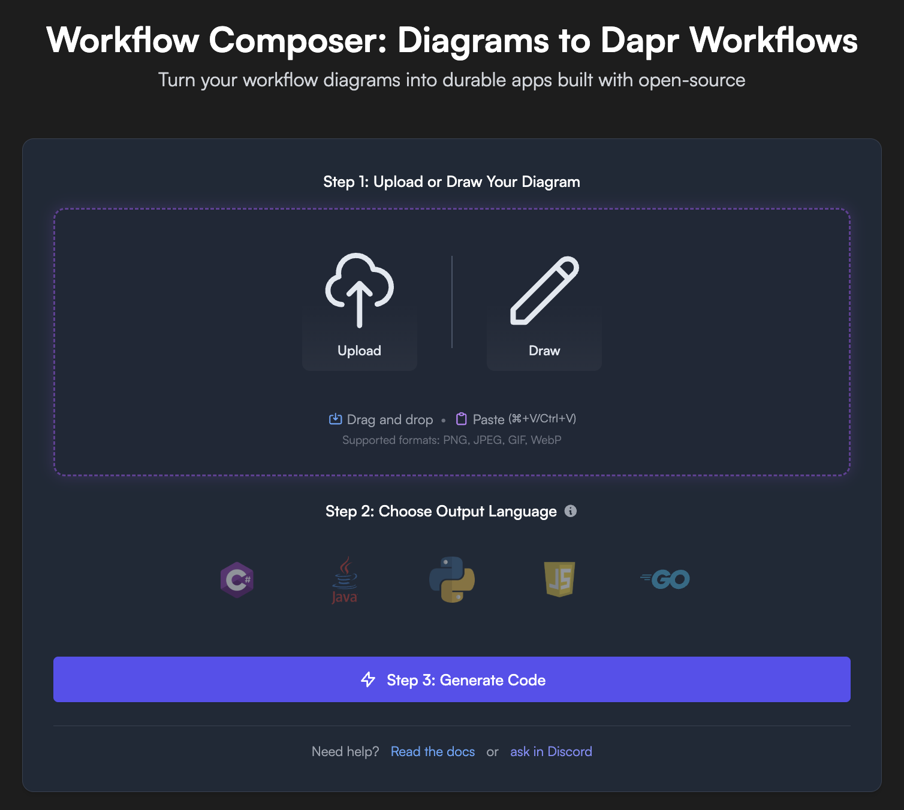
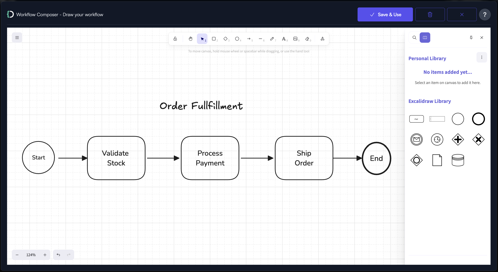
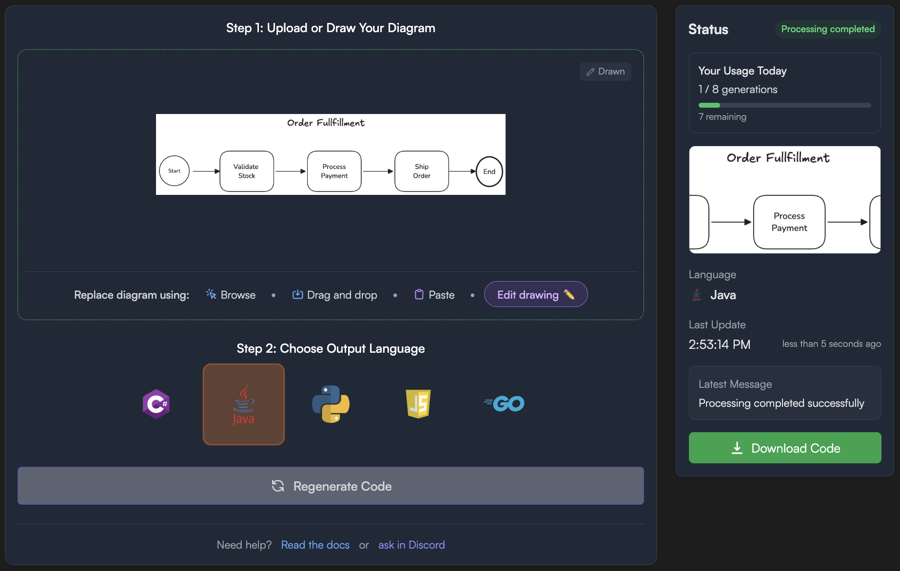

In this challenge, you'll learn how to use Diagrid Workflow Composer to quickly generate Dapr workflow applications from visual diagrams using AI.

## 1. What is Workflow Composer

[Workflow Composer](https://diagrid.ws/workflows) is a free AI service offered by Diagrid that transforms workflow diagrams into ready-to-run Dapr workflow applications in multiple programming languages.

Its goal is to bridge the gap between visual workflow design and code implementation, enabling both technical and non-technical users to collaborate on workflow design and instantly convert those designs into ready-to-run Dapr code that you can extend and customize. This dramatically speeds up starting new workflow project creation.

## 2. How Workflow Composer Works

Before you begin, navigate to https://diagrid.ws/workflows and if you haven't already, create an account and log in.



Workflow Composer follows a simple three-step process to generate workflow applications:

1. **Design Your Workflow**: Upload an existing diagram, choose from our gallery of common patterns, or draw your own workflow using the built-in editor.

2. **Choose Output Language**: Select from supported languages including .NET, Java, Python, JavaScript, and Go.

3. **Generate and Download**: Get a complete Dapr workflow project ready to run locally.

Let's go through each step and demonstrate how quick and effective it is.

## 3. Design Your Workflow

There are different ways to come up with a workflow design and use it in Workflow Composer. Let's explore each approach:

### 3.1. Use an Existing Diagram

If you have an existing workflow application or business process, you can export the diagram from there and upload it to Workflow Composer. You can even sketch a diagram on a napkin and take a picture with your phone, or draw it on a whiteboard and take a picture. Workflow Composer is using AI to understand the business process expressed by the diagram and it is really good at interpreting common notations such as BPMN, or generic workflow boxes and arrows with some text.

Simply click the **"Browse"** button to upload your diagram.

### 3.2. Choose from the Gallery

Alternatively, you can use our gallery where we have common patterns as a good starting point. The gallery includes:

- **Sequential**: Simple linear workflows with ordered activities
- **Conditional**: Decision-based workflows with branching logic  
- **Parallel**: Fan-out/fan-in patterns for concurrent execution
- **External Events**: Workflows that wait for external triggers
- **Loops**: Iterative workflows for repeated operations

These patterns are based on Dapr's workflow features and represent the most common patterns used as starting points in implementing more complex real-world business processes.

For this tutorial, scroll down to the "Not sure where to begin?" section and click on the **"order_fulfillment"** example from the sequential category.

### 3.3. Draw Your Own Diagram

You can also either draw a diagram from scratch using our drawing feature or edit one of the images from the gallery.

With the order fulfillment workflow loaded from the gallery, click the **"Edit drawing"** button to modify it. Try renaming the "Check Inventory" activity to "Validate Stock" by double-clicking on it. Our design tool offers workflow notations that Dapr Workflow supports, ensuring your visual design translates accurately into working Dapr code.



Once you've made your changes, click **"Save & Use"** to finalize your workflow design.

## 4. Choose Output Language

Pick your desired language as Workflow Composer can generate applications in different programming languages. The quality of the generated code may vary between languages, as we continuously improve the implementation across languages to deliver better code quality.

For this tutorial, select **Java** by clicking on the Java icon in the language selection area.  

## 5. Generate Code and Download

Click the **"Generate Code"** button to create your Java workflow application. Workflow Composer will process your diagram and generate a complete Dapr workflow project.

The generation process typically takes a few seconds and creates:
- Java workflow classes
- Activity implementations
- Maven project structure (for Java)
- Dapr component configurations
- README with setup instructions



Once generation is complete, click the **"Download Code"** button to download a ZIP file containing your complete Java workflow project.

## 6. Examine and Run the Project

### 6.1. Extract and Examine the Project

Extract the downloaded ZIP file and explore the generated project structure. You'll find:

```text,nocopy
order_fulfillment_java/
├── src/
│   └── main/
│       ├── java/
│       │   └── orderfulfillmentworkflow/
│       │       ├── Application.java
│       │       ├── OrderFulfillmentWorkflow.java
│       │       ├── WorkflowConfiguration.java
│       │       ├── WorkflowController.java
│       │       ├── activities/
│       │       ├── models/
│       │       └── utils/
│       └── resources/
├── components/
├── pom.xml
├── dapr.yaml
├── README.md
├── Makefile
├── mvnw
├── mvnw.cmd
├── OrderFulfillmentWorkflow.png
├── workflow-jetbrains.http
└── workflow-vscode.http
```

The generated code includes:
- A complete Maven project with all necessary dependencies
- Workflow definition class that orchestrates your activities
- Individual activity classes with placeholder implementations
- Dapr configuration files for local development
- Multi-app run configuration for easy testing
- HTTP test files for popular IDEs

Take a closer look at the activities folder containing all the activity definitions from your diagram. Each activity represents a discrete step in your workflow process, ready for you to implement with your specific business logic.

Examine the `OrderFulfillmentWorkflow.java` class carefully - this represents the workflow logic as understood from your diagram, including any conditional execution logic and branching decisions. This is the core of the application that orchestrates the sequence of activities and defines how data flows through your business process.

Additional key files include:
- `Application.java` - Contains Spring Boot configuration to wire the app together and start the application
- `WorkflowController.java` - Provides all the REST endpoints to interact with the workflow app, allowing you to start, monitor, and manage workflow instances

### 6.2. Run the Workflow App

Open the project in your favorite IDE and follow the instructions in the README to compile with Maven and run it with Dapr CLI:

```bash,run
# Build the project
mvn clean package -DskipTests

# Run with Dapr CLI
dapr run -f .
```

The README file contains comprehensive step-by-step instructions for both local Dapr development and cloud deployment with Diagrid Catalyst, including prerequisites, setup steps, and testing commands.

## 7. Benefits of Workflow Composer

Using Diagrid Workflow Composer provides several key advantages for workflow development:

• **Rapid Prototyping** - Transform workflow ideas into working code in minutes rather than hours or days. The visual-first approach allows you to focus on business logic rather than boilerplate code, dramatically accelerating your development cycles.

• **Cross-Language Support** - Generate the same workflow logic in multiple programming languages, enabling teams to work in their preferred technology stack while maintaining consistent workflow patterns across different implementations.

• **Best Practices Built-In** - Generated code follows Dapr workflow best practices and patterns, including proper error handling, deterministic execution, and activity separation, ensuring your workflows are production-ready from the start.

• **Extensible Foundation** - The generated code serves as a solid foundation that you can extend with custom business logic in activities, integration with external services, advanced error handling and compensation, and performance optimizations.

• **Collaboration Bridge** - Enables seamless collaboration between business stakeholders who design workflows visually and developers who implement the detailed logic, reducing the gap between requirements and implementation.

You've now experienced how Diagrid Workflow Composer can accelerate workflow development by transforming visual diagrams into ready-to-run Dapr workflow applications. If you have a workflow you want to implement in Dapr, head over to Workflow Composer and quickly design and get it running in minutes. 
