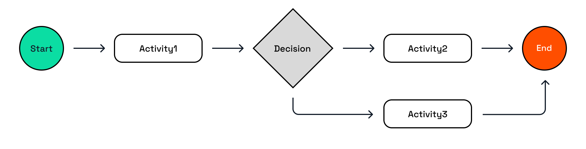
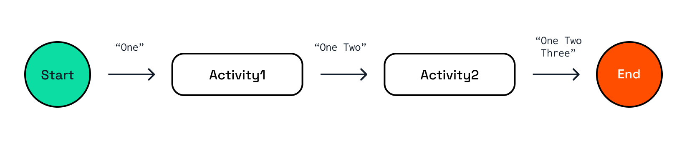

# Dapr Workflow Fundamentals

In this challenge, you'll learn:

- How Dapr workflows and activities are defined in code.
- How workflows are started.
- How to get the status of a workflow instance.
- How the workflow engine persists workflow state.

> The code you see in this Dapr University track is available in the [Dapr QuickStarts](https://github.com/dapr/quickstarts/) repository in the `tutorials/workflow` folder. If you want to explore more code samples for other Dapr APIs in this repo, you can do so after completing this track.

## 1. Workflows and Activities

Workflows are authored in code using the Dapr Workflow SDK. Workflows are composed of activities, which are the building blocks of a workflow. Activities typically contain code that performs one specific task, such as synchronously calling another service, storing data in a state store, performing a calculation, or publishing a message to a topic.



Workflows orchestrate the activities in a specific order. Workflow code typically contains calls to activities and business logic (if/else statements) based on the outputs of activities to determine which activity should be executed next. Workflow code should be deterministic, meaning that the same input for either workflows or activities, should always result in the same output. Any non-deterministic code should be placed in an activity. More information about (non)deterministic code is covered in a later challenge of this Dapr University track.

## 2 A basic workflow demo

The workflow in this challenge consists of two activities that are called in sequence. The workflow is started with an input of `"One"`. The first activity adds `" Two"` to the input and returns `"One Two"`. The second activity adds `" Three"` to the output of the first activity. The final output of the workflow is `"One Two Three"`.



### 2.1 Choose a language tab

Use one of the language tabs to navigate to the basic workflow example. Each language tab contains a workflow application and a `dapr.yaml` file that is used to run the example.

### 2.2 Inspect the Workflow code

Use the language-specific instructions to learn more about workflow code.

<details>
   <summary><b>.NET</b></summary>

Open the `BasicWorkflow.cs` file located in the `Basic` folder. This file contains the workflow code.

The `BasicWorkflow` class inherits from an abstract `Workflow` class provided by the Dapr Workflow SDK. The generic arguments specify the input and output types of the workflow.

The `BasicWorkflow` class overrides the `RunAsync` method from the base class. This method is the entry point of the workflow.

Workflows are asynchronous and return a `Task` object. In this case, the return type is `Task<string>`.

The `WorkflowContext` input argument is provided by the Dapr Workflow SDK and contains properties and methods of the workflow instance. The second input argument is the input argument for the workflow.

You can use any type of input and output for the workflow, as long as they are serializable.

The body of the `RunAsync` method in this example contains two calls to activities using the `CallActivityAsync` method. The generic argument defines the output type of the activity. The first input argument is the name of the activity; the second input argument is the input for the activity.

</details>

### 2.3 Inspect the Activity code

Use the language-specific instructions to learn more about activity code.

<details>
   <summary><b>.NET</b></summary>

Open the `Activity1.cs` file located in the `Basic/Activities` folder. This file contains the code for Activity1.

The `Activity1` class inherits from an abstract `WorkflowActivity` class provided by the Dapr Workflow SDK, the generic arguments specify the input and the output types of the activity.

The `Activity1` class overrides the `RunAsync` method from the base class. This method is the entry point of the activity.

Activities are asynchronous and return a `Task` object. In this case, the return type is `Task<string>`.

The `WorkflowActivityContext` input argument is provided by the Dapr Workflow package and contains the instance ID of workflow. The second input argument is the input argument for the workflow.

You can use any type of input and output for the workflow, as long as they are serializable.

The body of the `RunAsync` method in this example just does a `Console.WriteLine` to echo the input and returns a string concatenation of the input and "Two".

Typically, activities contain code that performs one specific task, such as calling an external service, storing data in a state store, performing a calculation, or publishing a message. A more realistic example will be shown in the *Combined Patterns* challenge later in this learning track.

</details>

### 2.4 Inspect the workflow & activity registration

Workflows and activities need to be registered in the workflow application. This is to ensure that Dapr can find the workflow and activities when they are scheduled.

Use the language-specific instructions to learn more about workflow registration.

<details>
   <summary><b>.NET</b></summary>

Locate the `Program.cs` file in the `Basic` folder. This file contains the code to register the workflow and activities using the `AddDaprWorkflow()` extension method.

This application also has a `start` HTTP POST endpoint that is used to start the workflow. It accepts a `string` as input, and this input is passed on to the workflow.

The `start` method also contains the `DaprWorkflowClient` as an input argument. This is injected by the Dapr SDK. The `DaprWorkflowClient` is used to schedule a new workflow using the `ScheduleNewWorkflowAsync` method. The first input argument for this method is the name of the workflow; the second input argument is the input for the workflow. The `DaprWorkflowClient` contains more methods to manage workflows. This will be covered in the *Workflow Management* challenge later in this learning track.

</details>

## 3. Start the workflow application

Use the language-specific instructions to start the workflow application. Use the *Dapr CLI* window to run the commands.

<details>
   <summary><b>Run the .NET workflow</b></summary>

Navigate to the *csharp/fundamentals* folder:

```bash
cd csharp/fundamentals
```

Install the dependencies:

```bash
dotnet restore Basic
```

Run the applications using the Dapr CLI:

```bash
dapr run -f .
```

Inspect the output of the Dapr CLI window. The workflow application should now be running.

</details>

## 4. Start the Basic workflow

Use the **curl** window to make a POST request to the `start` endpoint of the workflow application and provide `One` as the input.

Use the language-specific instructions to start the basic workflow.

<details>
   <summary><b>Run the .NET workflow</b></summary>

In the *curl* window, run the following command to start the workflow:

```curl
curl -i --request POST http://localhost:5254/start/One
```

Expected output:

```text
HTTP/1.1 202 Accepted
Content-Length: 0
Date: Wed, 16 Apr 2025 13:54:29 GMT
Server: Kestrel
Location: 05f63e15a3724c5d86386922919378d6
```

Note the `Location` header in the response. This header contains the workflow instance ID. You can use this ID to get the status of the workflow instance you just started.

</details>

## 5. Get the workflow status

Use the language-specific instructions to get the workflow instance status.

<details>
   <summary><b>Get the .NET workflow status</b></summary>

Use the **curl** window to make a GET request to get the status of a workflow instance:

```curl
curl --request GET --url http://localhost:3554/v1.0/workflows/dapr/<INSTANCEID>
```

Where `<INSTANCEID>` is the workflow instance ID you received in the `LOCATION` header in the previous step.

Example:

```curl
curl --request GET --url http://localhost:3554/v1.0/workflows/dapr/05f63e15a3724c5d86386922919378d6
```

Expected output:

```json
{"instanceID":"05f63e15a3724c5d86386922919378d6","workflowName":"BasicWorkflow","createdAt":"2025-04-16T13:54:30.688455621Z","lastUpdatedAt":"2025-04-16T13:54:30.720682100Z","runtimeStatus":"COMPLETED","properties":{"dapr.workflow.input":"\"One\"","dapr.workflow.output":"\"One Two Three\""}}
```

The workflow status contains the workflow instance ID, the workflow name, the created and last updated timestamps, the runtime status (`COMPLETED`), and the input and output of the workflow.

</details>

## 6. Workflow state and replay

Dapr workflow uses durable execution, which means the workflow state is persisted to a state store. Each workflow state change is persisted to the state store. This includes:

- The start of a workflow, including the workflow input.
- The start and completion of an activity, including the input and output of the activity.
- The completion of a workflow, including the workflow output.

This animation shows when workflow state is persisted and retrieved during workflow replays:


The state store component used by Dapr workflow in this example is defined in the `state_redis.yaml` file that is located in the `resources` folder.

```bash
docker exec -it dapr_redis redis-cli
```

Use the *Redis* window and use the following command to list all the keys in the Redis container that belong to the `basic` workflow you've just executed:

```bash
keys *basic||dapr.internal.default.basic.workflow*
```

You should never edit the workflow state directly, to prevent corrupting the data of workflows that are still running. The Dapr Workflow Client is used to manage workflow instances, and this is covered in the *Workflow Management* challenge later in this learning track.

---

You now know how Dapr workflows and activities are defined in code, how to start a workflow and get its status, and how the workflow engine persists workflow state. Let's continue with the various workflow patterns you can apply in your workflow applications.