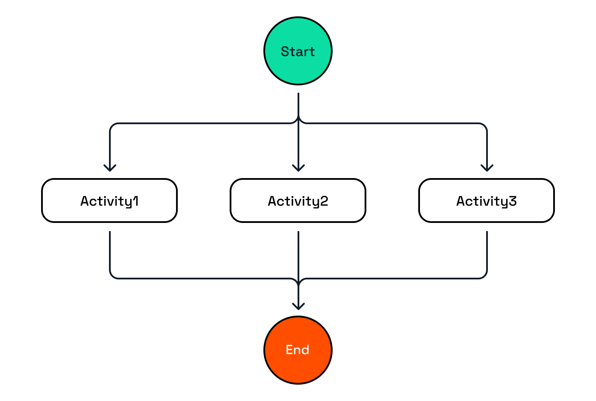

# Workflow Pattern: Fan-out / Fan-in

In this challenge, you'll explore a workflow application that demonstrates the fan-out/fan-in pattern.

## 1. Fan-out / Fan-in

The fan-out/fan-in pattern is used when there is no dependency between the activities in the workflow. The activities can be executed in parallel, the workflow will wait until all activities are completed and the results from the activities can be aggregated into a single result.



The workflow in this challenge consists of three activities that are called in parallel.

- The workflow is started with an input of an array of words `["which","word","is","the","shortest"]`.
- For each of the words in the array, an activity is created that determines the length of the word.
- Once all the tasks are created, they are scheduled in parallel and the workflow waits until they are all completed.
- The workflow then aggregates the results and returns the shortest word: `"is"`.

### 1.1. Choose a language tab

Use one of the language tabs to navigate to the fan-out/fan-in workflow example. Each language tab contains a workflow application, and a Multi-App Run `dapr.yaml` file that is used to run the example.

### 1.2. Inspect the Workflow code

Use the language-specific instructions to learn more about the fan-out/fan-in workflow.

<details>
   <summary><b>.NET workflow code</b></summary>

Open the `FanOutFanInWorkflow.cs` file located in the `FanOutFanIn` folder. This file contains the workflow code.

Notice that has an `input` of type `string[]`.  The workflow uses a `foreach` loop to iterate over the input array and create a task for each word in the array. Instead of awaiting each task inside the `foreach` loop, the tasks are added to a list of tasks, which is then passed to the `Task.WhenAll()` method outside the loop. At this moment the the workflow engine will schedule all the activities (fan-out), and the workflow will wait until all activities have been completed (fan-in).

```csharp
// This list will contain the tasks that will be executed by the Dapr Workflow engine.
List<Task<WordLength>> tasks = new();
        
foreach (string item in input)
{
   // Tasks are added to the list
   tasks.Add(context.CallActivityAsync<WordLength>(
      nameof(GetWordLength),
      item));
}

// The Dapr Workflow engine will schedule all the tasks and wait for all tasks to complete before continuing.
var allWordLengths = await Task.WhenAll(tasks);
```

</details>

### 1.3. Inspect the Activity code

<details>
   <summary><b>.NET activity code</b></summary>

The workflow uses only one activity, `GetWordLength`, and is located in the `FanOutFanIn/Activities` folder.

</details>

### 1.4. Inspect the workflow & activity registration

Use the language-specific instructions to learn more about workflow registration.

<details>
   <summary><b>.NET</b></summary>

Locate the `Program.cs` file in the `FanOutFanIn` folder. This file contains the code to register the workflow and activities using the `AddDaprWorkflow()` extension method.

This application also has a `start` HTTP POST endpoint that is used to start the workflow, and accepts an array of strings as the input.

</details>

## 2. Run the workflow app

Use the language-specific instructions to start the workflow application.

<details>
   <summary><b>Run the .NET application</b></summary>

Use the **Dapr CLI** window to run the commands.

Navigate to the *csharp/fan-out-fan-in* folder:

```bash
cd csharp/fan-out-fan-in
```

Install the dependencies and build the project:

```bash
dotnet build FanOutFanIn
```

Run the application using the Dapr CLI:

```bash
dapr run -f .
```

</details>

Inspect the output of the **Dapr CLI** window. Wait until the application is running before continuing.

## 3. Start the workflow

Use the **curl** window to make a POST request to the `start` endpoint of the workflow application.

Use the language-specific instructions to start the fan-out/fan-in workflow.

<details>
   <summary><b>Start the .NET workflow</b></summary>

In the **curl** window, run the following command to start the workflow:

```curl
curl -i --request POST \
  --url http://localhost:5256/start \
  --header 'content-type: application/json' \
  --data '["which","word","is","the","shortest"]'
```

Expected output:

```text
HTTP/1.1 202 Accepted
Content-Length: 0
Date: Thu, 17 Apr 2025 13:41:03 GMT
Server: Kestrel
Location: 402bc03326e94ea9af5e400b1a718b8b
```

The **Dapr CLI** window should contain these application log statements:

```text
== APP - fanoutfanin == GetWordLength: Received input: is.
== APP - fanoutfanin == GetWordLength: Received input: which.
== APP - fanoutfanin == GetWordLength: Received input: the.
== APP - fanoutfanin == GetWordLength: Received input: shortest.
== APP - fanoutfanin == GetWordLength: Received input: word.
```

> [!NOTE]
> the order of the log statements may vary, as the activities are executed in parallel.

</details>

## 4. Get the workflow status

Use the **curl** window to perform a GET request directly the Dapr workflow management API to retrieve the workflow status.

Use the language-specific instructions to get the workflow instance status.

<details>
   <summary><b>Get the .NET workflow status</b></summary>

Use the **curl** window to make a GET request to get the status of a workflow instance:

```curl
curl --request GET --url http://localhost:3556/v1.0/workflows/dapr/<INSTANCEID>
```

Where `<INSTANCEID>` is the workflow instance ID you received in the `Location` header in the previous step.

Expected output:

```json
{"instanceID":"402bc03326e94ea9af5e400b1a718b8b","workflowName":"FanOutFanInWorkflow","createdAt":"2025-04-17T13:41:04.035237868Z","lastUpdatedAt":"2025-04-17T13:41:04.083785576Z","runtimeStatus":"COMPLETED","properties":{"dapr.workflow.input":"[\"which\",\"word\",\"is\",\"the\",\"shortest\"]","dapr.workflow.output":"\"is\""}}
```

</details>

## 5. Stop the workflow application

Use the **Dapr CLI** window to stop the workflow application by pressing `Ctrl+C`.

---

You've now seen how to use the fan-out/fan-in pattern in a workflow application. Let's move on another pattern: *monitor*.
