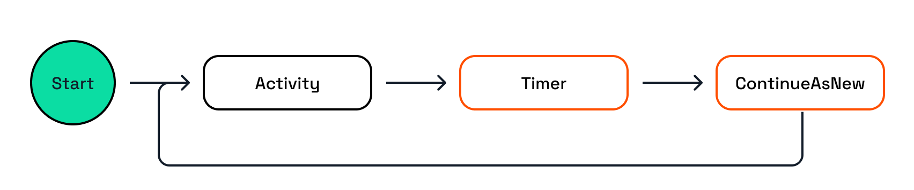

# Workflow pattern: Monitor

In this challenge, you'll explore a workflow application that demonstrates the monitor pattern.

## 1. Monitor

The monitor pattern is used to execute recurring tasks, for instance running a nightly job to clean up cloud resources. Workflows that use the monitor pattern can run indefinitely or it can stop based on a condition, such as the output of an activity.



The workflow in this challenge consists of one activity and calling two methods on the `WorkflowContext`.

- The workflow is started with an input argument `counter` with value `0`.
- The `CheckStatus` activity is called which simulates a status of an external resource.
- If the status is not ready, the workflow creates a timer via the `WorkflowContext`, and waits until the timer expires.
- The workflow increments the `counter` and continues as a fresh workflow instance (keeping the same instance ID) via the `ContinueAsNew` method on the `WorkflowContext`. This means that the workflow instance does not have its historical data associated to it anymore.

> This continuation of the workflow is essentially a way of running the workflow in a loop, but in a deterministic way. Use this method instead of doing a `while` loop in the workflow code.

### 1.1. Choose a language tab

Use one of the language tabs to navigate to the monitor workflow example. Each language tab contains a workflow application, and a Multi-App Run `dapr.yaml` file that is used to run the example.

### 1.2. Inspect the Workflow code

Use the language-specific instructions to learn more about the monitor workflow.

<details>
   <summary><b>.NET workflow code</b></summary>

Open the `MonitorWorkflow.cs` file located in the `Monitor` folder. This file contains the workflow code.

Note how the workflow uses the `WorkflowContext` to create a timer and to continue the workflow as a fresh instance.

```csharp
if (!status.IsReady)
{
   await context.CreateTimer(TimeSpan.FromSeconds(1));
   counter++;
   context.ContinueAsNew(counter);
}
```

</details>

### 1.3. Inspect the Activity code

<details>
   <summary><b>.NET activity code</b></summary>

The workflow uses only one activity, `CheckStatus`, and is located in the `Monitor/Activities` folder. It uses a random number generator to simulate the status of a fictional external resource.

</details>

### 1.4. Inspect the workflow & activity registration

Use the language-specific instructions to learn more about workflow registration.

<details>
   <summary><b>.NET</b></summary>

Locate the `Program.cs` file in the `Monitor` folder. This file contains the code to register the workflow and activities using the `AddDaprWorkflow()` extension method.

This application also has a `start` HTTP POST endpoint that is used to start the workflow, and accepts an array of strings as the input.

</details>

## 2. Run the workflow app

Use the language-specific instructions to start the workflow application. Use the **Dapr CLI** window to run the commands.

<details>
   <summary><b>Run the .NET application</b></summary>

Navigate to the *csharp/monitor-pattern* folder:

```bash
cd csharp/monitor-pattern
```

Install the dependencies and build the project:

```bash
dotnet build Monitor
```

Run the application using the Dapr CLI:

```bash
dapr run -f .
```

</details>

Inspect the output of the **Dapr CLI** window. The application should now be running.

## 3. Start the workflow

Use the **curl** window to make a POST request to the `start` endpoint of the workflow application.

Use the language-specific instructions to start the monitor workflow.

<details>
   <summary><b>Start the .NET workflow</b></summary>

In the **curl** window, run the following command to start the workflow:

```curl
curl -i --request POST http://localhost:5257/start/0
```

Expected output:

```text
HTTP/1.1 202 Accepted
Content-Length: 0
Date: Thu, 17 Apr 2025 13:41:03 GMT
Server: Kestrel
Location: 402bc03326e94ea9af5e400b1a718b8b
```

Use the workflow instance ID from the `Location` to get the status of the workflow instance you just started.

In the **Dapr CLI** window you should see application logs with the incremented counter value:

```text
== APP - monitor == CheckStatus: Received input: 0.
== APP - monitor == CheckStatus: Received input: 1.
== APP - monitor == CheckStatus: Received input: 2.
...
```

</details>

## 4. Get the workflow status

Use the **curl** window to perform a GET request directly the Dapr workflow management API to retrieve the workflow status.

Use the language-specific instructions to get the workflow instance status.

<details>
   <summary><b>Get the .NET workflow status</b></summary>

Use the **curl** window to make a GET request to get the status of a workflow instance:

```curl
curl --request GET --url http://localhost:3557/v1.0/workflows/dapr/<INSTANCEID>
```

Where `<INSTANCEID>` is the workflow instance ID you received in the `Location` header in the previous step.

Expected output:

```json
{"instanceID":"47e1e4db2ef84bc2b9719d6ba44893e8","workflowName":"MonitorWorkflow","createdAt":"2025-04-17T14:45:18.000956270Z","lastUpdatedAt":"2025-04-17T14:45:18.012774986Z","runtimeStatus":"COMPLETED","properties":{"dapr.workflow.input":"7","dapr.workflow.output":"\"Status is healthy after checking 7 times.\""}}
```

> The actual number of the counter can vary based on the random number generator in the `CheckStatus` activity.

</details>

## 5. Stop the workflow application

Use the **Dapr CLI** window to stop the workflow application by pressing `Ctrl+C`.

---

You've now seen how to use the monitor pattern in a workflow application. Let's move on another pattern: *external system interaction*.
