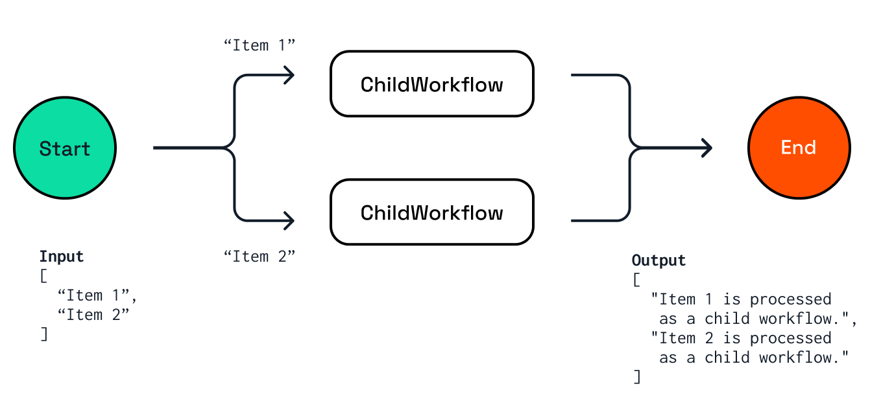

# Child Workflows

In this challenge, you'll explore a workflow application that demonstrates how to call child workflows from a parent workflow.

## 1. Child Workflows

Workflows can call other workflows, which are referred to as child workflows. This allows the creation of complex workflows by composing smaller, reusable workflows, which can be individually tested.


The parent workflow in this challenge uses the fan-out/fan-in pattern to call multiple child workflows in parallel.

- The workflow is started with an array of strings as the input argument.
- For each string in the input array, a child workflow task is created.
- Each child workflow uses task chaining to call two activities.
- The parent workflow waits for all child workflows to complete and aggregates the results into a single result.



### 1.1 Choose a language tab

Use one of the language tabs to navigate to the basic workflow example. Each language tab contains a workflow application, and a `dapr.yaml` file that is used to run the example in the next step.

### 1.2 Inspect the parent workflow code

<details>
   <summary><b>.NET</b></summary>

Open the `ParentWorkflow.cs` file located in the `ChildWorkflows` folder. This file contains the code for the parent workflow.

The `CallChildWorkflowAsync` method is used to call the child workflow. The first argument is the name of the child workflow, and the second argument is the input for the child workflow.

```csharp
foreach (string item in input)
{
   childWorkflowTasks.Add(context.CallChildWorkflowAsync<string>(
      nameof(ChildWorkflow),
      item));
}
```

</details>

### 1.3 Inspect the child workflow code

<details>
   <summary><b>.NET</b></summary>

Open the `ChildWorkflow.cs` file located in the `ChildWorkflows` folder. This file contains the code for the child workflow. This workflow uses task chaining to call two activities, `Activity1` and `Activity2`, in sequence.

</details>

### 1.4. Inspect the workflow & activity registration

Use the language-specific instructions to learn more about workflow registration.

<details>
   <summary><b>.NET</b></summary>

Locate the `Program.cs` file in the `ChildWorkflows` folder. This file contains the code to register the workflows and activities using the `AddDaprWorkflow()` extension method.

This application also has a `start` HTTP POST endpoint that is used to start the workflow, and accepts an array of string as the input.

</details>

## 2. Start the workflow app

Use the language specific instructions to start the basic workflow.

<details>
   <summary><b>Run the .NET workflow</b></summary>

Install the dependencies and build the project:

```bash
dotnet build ChildWorkflows
```

Run the application using the Dapr CLI:

```bash
dapr run -f .
```

</details>

Inspect the output of the **Dapr CLI** window. The application should now be running.

## 3. Start the workflow

Use the **curl** window to make a POST request to the `start` endpoint of the workflow application.

Use the language-specific instructions to start the external system interaction workflow.

<details>
   <summary><b>Start the .NET workflow</b></summary>

In the **curl** window, run the following command to start the workflow:

```curl
curl -i --request POST \
  --url http://localhost:5259/start \
  --header 'content-type: application/json' \
  --data '["Item 1","Item 2"]'
```

Expected output:

```text
HTTP/1.1 202 Accepted
Content-Length: 0
Date: Thu, 17 Apr 2025 15:37:51 GMT
Server: Kestrel
Location: b7dd836b-e913-4446-9912-d400befebec5
```

The **Dapr CLI** window should contain these application log statements:

```text
== APP - childworkflows == Activity1: Received input: Item 2.
== APP - childworkflows == Activity1: Received input: Item 1.
== APP - childworkflows == Activity2: Received input: Item 1 is processed.
== APP - childworkflows == Activity2: Received input: Item 2 is processed.
```

> Note: the order of the log statements may vary, as the child workflows are executed in parallel.

</details>

## 4. Get the workflow status

Use the **curl** window to perform a GET request directly the Dapr workflow management API to retrieve the workflow status.

Use the language-specific instructions to get the workflow instance status.

<details>
   <summary><b>Get the .NET workflow status</b></summary>

Use the **curl** window to make a GET request to get the status of a workflow instance:

```curl
curl --request GET --url http://localhost:3559/v1.0/workflows/dapr/<INSTANCEID>
```

Where `<INSTANCEID>` is the workflow instance ID you received in the `Location` header in the previous step.

Expected output:

```json
{"instanceID":"0be522fda3db4963b6be9e8828c85938","workflowName":"ParentWorkflow","createdAt":"2025-04-22T13:39:06.694524219Z","lastUpdatedAt":"2025-04-22T13:39:06.994152799Z","runtimeStatus":"COMPLETED","properties":{"dapr.workflow.input":"[\"Item 1\",\"Item 2\"]","dapr.workflow.output":"[\"Item 1 is processed as a child workflow.\",\"Item 2 is processed as a child workflow.\"]"}}
```

</details>

## 5. Stop the workflow application

Use the **Dapr CLI** window to stop the workflow application by pressing `Ctrl+C`.

---

You now know how to compose a parent workflow from smaller child workflows. Now, let's have a look at resiliency and compensation in workflows.
