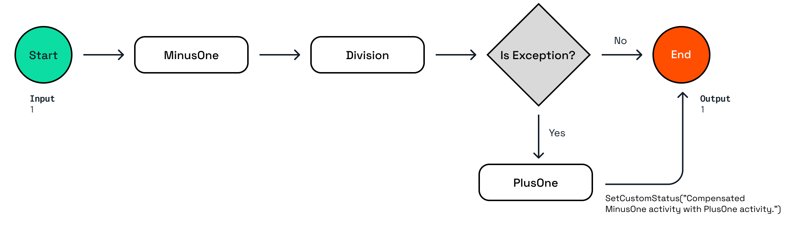

# Resiliency and Compensation

In this challenge, you'll learn:

- How to add retry policies when calling activities.
- How to use try/catch blocks in workflows and how to compensate for failing activity calls.

## 1. Resiliency and Compensation

**Resiliency**
Activities can fail for various reasons, perhaps the service that is called in the activity returns an unexpected result, or the service is temporarily unavailable. For transient failures, you can write retry policies in the workflow to retry activity calls.

These workflow retry policies are different from the Dapr yaml based declarative policies for components or apps. If code inside activities use the Dapr API to interact with components or apps it is recommended to use the yaml based resiliency policies. If the activity does not use any Dapr API, use the retry policies in the workflow code.

**Compensation actions**
When authoring workflows, you should anticipate handling exceptions and potentially compensate for any failed activity calls. This is especially important when mutations are made to external systems, before the failure occurred, but these mutations need to be rolled back after an activity failure.

The workflow in this challenge performs a simplistic calculation where the first activity, `MinusOne`, subtracts 1 from the numeric workflow input, the result is used as the divisor in the second activity, `Division`. The result of the division is passed as the output of the workflow. If the workflow input is `1`, the divisor results in `0`, causing an exception in the `Division` activity, which would result in a failed workflow. The workflow in this challenge contains a try/catch block that catches the exception, and makes a call to another activity, `PlusOne`, to perform a compensation action, to reset the input value.



A more realistic scenario where compensation actions are useful is when a workflow calls an activity that creates a new record in an external system. If a subsequent activity fails after the record is created, the workflow can call another activity to remove the new record, or inform another system about the failure.

### 1.1 Choose a language tab

Use one of the language tabs to navigate to the basic workflow example. Each language tab contains a workflow application, and a `dapr.yaml` file that is used to run the example in the next step.

### 1.2 Inspect the Workflow code

<details>
   <summary><b>.NET</b></summary>

Open the `ResiliencyAndCompensationWorkflow.cs` file located in the `ResiliencyAndCompensation` folder. This file contains the workflow code.

```csharp
var defaultActivityRetryOptions = new WorkflowTaskOptions
{
   RetryPolicy = new WorkflowRetryPolicy(
      maxNumberOfAttempts: 3,
      firstRetryInterval: TimeSpan.FromSeconds(2)),
};
```

This `WorkflowTaskOptions` defines a retry policy that retries activities up to 3 times with an initial delay of 2 seconds.

```csharp
var result1 = await context.CallActivityAsync<int>(
   nameof(MinusOne),
   input,
   defaultActivityRetryOptions);
```

The `defaultActivityRetryOptions` are passed as the third argument to the `CallActivityAsync` methods in this workflow.

</details>

### 1.3 Inspect the Activity code

<details>
   <summary><b>.NET</b></summary>

Open the `Activity1.cs` file located in the `Basic/Activities` folder. This file contains the code for Activity1.


</details>

## 2. Start the workflow app

Use the language specific instructions to start the basic workflow.

<details>
   <summary><b>Run the .NET workflow</b></summary>

	Install the dependencies:

```bash
dotnet restore TaskChaining
```

Run the applications using the Dapr CLI:

```bash
dapr run -f .
```
</details>

## 3. Start the workflow

## 4. Get the workflow status

---

Next step: ...