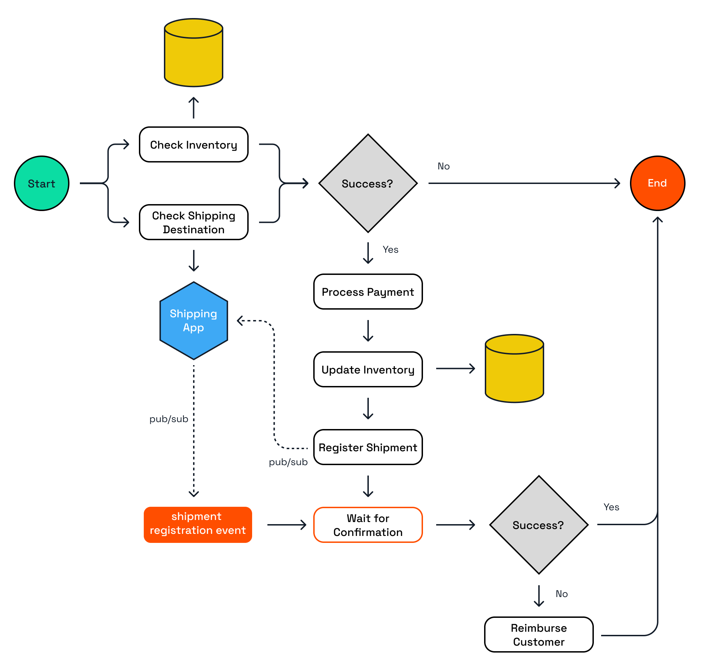

# Combined Patterns

In this challenge, you'll explore a more realistic example of a workflow application, that uses several workflow patterns and multiple Dapr APIs.

## 1. Combined Patterns

It's common for a workflow to use combine different workflow patterns such as task chaining, fan-out/fan-in, and waiting for external events. Dapr workflow works great with the other Dapr APIs, such as state management, pub/sub, and secrets. These APIs always need to be used in activities, and not in the workflow code.

In this challenge, you'll explore a Workflow App that interacts with a state store, and communicates with another Dapr application, Shipping App, via service invocation and pub/sub.



The workflow simulates an order processing flow:

- The workflow is started with an order object as the input argument.
- Two checks are done in a fan-out
  /fan-in pattern:
  - An inventory check is done to verify if the ordered item is in stock.
  - A shipping destination check is done to verify that the shipping provider can ship the item to the destination.
- If both checks are successful, an activity is called to process the payment.
- The inventory is updated.
- The shipment is registered with the Shipping App via pub/sub.
- The Shipping App publishes a message back to the Workflow App.
- The workflow waits for this message to arrive and based on the payload of the event, the workflow either completes successfully or an activity is called to reimburse the customer (the compensation action).

### 1.1 Choose a language tab

Use one of the language tabs to navigate to the combined patterns example. Each language tab contains a workflow application, a shipping application, and a Multi-App Run `dapr.yaml` file that is used to run the example.

### 1.2 Inspect the Workflow code

<details>
   <summary><b>.NET</b></summary>

Open the `OrderWorkflow.cs` file located in the `WorkflowApp` folder. This file contains the workflow code.

</details>

### 1.3 Inspect the Activity code

<details>
   <summary><b>.NET</b></summary>

The activity definitions are located in the `WorkflowApp/Activities` folder. The activities are:

- `CheckInventory`: checks if the item is in stock. This activity uses the Dapr state management API to check the inventory.
- `CheckShippingDestination`: checks if the item can be shipped to the destination. This activity uses the Dapr service invocation API to call the `checkDestination` method on the Shipping App.
- `ProcessPayment`: simulates a payment process. This activity only logs the input and returns a success message.
- `UpdateInventory`: updates the inventory. This activity uses the Dapr state management API to update inventory.
- `RegisterShipment`: registers the shipment with the Shipping App. This activity uses the Dapr pub/sub API to publish a message to the `shipment-registration-events` topic.
- `ReimburseCustomer`: simulates a reimbursement for the customer. This activity only logs the input and returns a success message.

</details>

### 1.4. Inspect the workflow & activity registration

Use the language-specific instructions to learn more about workflow registration.

<details>
   <summary><b>.NET</b></summary>

Locate the `Program.cs` file in the `WorkflowApp` folder. This file contains the code to register the workflows and activities using the `AddDaprWorkflow()` extension method.

Th WorkflowApp has the following HTTP endpoints:

- `start`, a POST endpoint that is used to start the workflow, and accepts an array of string as the input.
- `shipmentRegistered`, a POST endpoint that is used to receive the shipment registration event from the Shipping App sent via pub/sub messaging. This endpoint uses the `DaprWorkflowClient` to raise an external event to the workflow instance with the shipment registration status.

</details>

### 1.5. Inspect the Shipping App

Use the language-specific instructions to learn more about workflow registration.

<details>
   <summary><b>.NET</b></summary>

Locate the `Program.cs` file in the `ShippingApp` folder. This file contains the following HTTP endpoints:

- `checkDestination`, a POST endpoint that that simulates a check if the shipper can ship to the destination. This endpoint is called by the `CheckShippingDestination` activity via service invocation. This method always returns a success message.
- `registerShipment`, a POST endpoint that is used to simulate the registration of a new shipment. This endpoint is handling messages for the subscription of the `shipment-registration-events` topic (published by the WorkflowApp). The method publishes a success status message to the `shipment-registration-confirmed-events` topic as long the order ID is not empty. This is because the order ID is used as the workflow instance ID, and the subscriber to this topic (`shipmentRegistered` method in the WorkflowApp)) needs the workflow instance ID to raise an event to that workflow instance.

</details>

### 1.6. Inspect the Dapr component files

Since the Dapr applications in the challenge use the Dapr pub/sub API, they also require Dapr component files to configure the pub/sub component and the (declarative) subscriptions. These component files can be found in the `resources` folder.

## 2. Run the workflow app

Use the language specific instructions to start the combined patterns workflow.

<details>
   <summary><b>Run the .NET application</b></summary>

Use the **Dapr CLI** window to run the commands.

Navigate to the *csharp/combined-patterns* folder:

```bash
cd csharp/combined-patterns
```

Install the dependencies and build the projects:

```bash
dotnet build ShippingApp
dotnet build WorkflowApp
```

Run the applications using the Dapr CLI:

```bash
dapr run -f .
```

</details>

Inspect the output of the **Dapr CLI** window. Wait until the applications are running before continuing.

## 3. Start the workflow

Use the **curl** window to make a POST request to the `start` endpoint of the workflow application.

Use the language-specific instructions to start the external system interaction workflow.

<details>
   <summary><b>Start the .NET workflow</b></summary>

In the **curl** window, run the following command to start the workflow:

```curl
curl -i --request POST \
   --url http://localhost:5260/start \
   --header 'content-type: application/json' \
   --data '{"id": "b0d38481-5547-411e-ae7b-255761cce17a","orderItem" : {"productId": "RBD001","productName": "Rubber Duck","quantity": 10,"totalPrice": 15.00},"customerInfo" : {"id" : "Customer1","country" : "The Netherlands"}}'
```

Expected output:

```text
HTTP/1.1 202 Accepted
Content-Length: 0
Date: Wed, 23 Apr 2025 12:08:02 GMT
Server: Kestrel
Location: b0d38481-5547-411e-ae7b-255761cce17a
```

The **Dapr CLI** window should contain these application log statements:

```text
== APP - order-workflow == CheckInventory: Received input: OrderItem { ProductId = RBD001, ProductName = Rubber Duck, Quantity = 10, TotalPrice = 15.00 }.
== APP - order-workflow == CheckShippingDestination: Received input: Order { Id = 06d49c54-bf65-427b-90d1-730987e96e61, OrderItem = OrderItem { ProductId = RBD001, ProductName = Rubber Duck, Quantity = 10, TotalPrice = 15.00 }, CustomerInfo = CustomerInfo { Id = Customer1, Country = The Netherlands } }.
== APP - shipping == checkDestination: Received input: Order { Id = 06d49c54-bf65-427b-90d1-730987e96e61, OrderItem = OrderItem { ProductId = RBD001, ProductName = Rubber Duck, Quantity = 10, TotalPrice = 15.00 }, CustomerInfo = CustomerInfo { Id = Customer1, Country = The Netherlands } }.
== APP - order-workflow == ProcessPayment: Received input: Order { Id = 06d49c54-bf65-427b-90d1-730987e96e61, OrderItem = OrderItem { ProductId = RBD001, ProductName = Rubber Duck, Quantity = 10, TotalPrice = 15.00 }, CustomerInfo = CustomerInfo { Id = Customer1, Country = The Netherlands } }.
== APP - order-workflow == UpdateInventory: Received input: OrderItem { ProductId = RBD001, ProductName = Rubber Duck, Quantity = 10, TotalPrice = 15.00 }.
== APP - order-workflow == RegisterShipment: Received input: Order { Id = 06d49c54-bf65-427b-90d1-730987e96e61, OrderItem = OrderItem { ProductId = RBD001, ProductName = Rubber Duck, Quantity = 10, TotalPrice = 15.00 }, CustomerInfo = CustomerInfo { Id = Customer1, Country = The Netherlands } }.
== APP - shipping == registerShipment: Received input: Order { Id = 06d49c54-bf65-427b-90d1-730987e96e61, OrderItem = OrderItem { ProductId = RBD001, ProductName = Rubber Duck, Quantity = 10, TotalPrice = 15.00 }, CustomerInfo = CustomerInfo { Id = Customer1, Country = The Netherlands } }.
== APP - order-workflow == Shipment registered for order ShipmentRegistrationStatus { OrderId = 06d49c54-bf65-427b-90d1-730987e96e61, IsSuccess = True, Message = }
```

> [!NOTE]
> The order of the log statements may vary, as the child workflows are executed in parallel.

</details>

## 4. Get the workflow status

Use the **curl** window to perform a GET request directly the Dapr workflow management API to retrieve the workflow status.

Use the language-specific instructions to get the workflow instance status.

<details>
   <summary><b>Get the .NET workflow status</b></summary>

Use the **curl** window to make a GET request to get the status of a workflow instance:

```curl
curl --request GET --url http://localhost:3560/v1.0/workflows/dapr/<INSTANCEID>
```

Where `<INSTANCEID>` is the workflow instance ID you received in the `Location` header in the previous step.

Expected output:

```json
{
   "instanceID":"b0d38481-5547-411e-ae7b-255761cce17a",
   "workflowName":"OrderWorkflow",
   "createdAt":"2025-04-23T12:08:02.625836530Z",
   "lastUpdatedAt":"2025-04-23T12:08:03.149685594Z",
   "runtimeStatus":"COMPLETED",
   "properties":{
      "dapr.workflow.input":"{\"Id\":\"b0d38481-5547-411e-ae7b-255761cce17a\",\"OrderItem\":{\"ProductId\":\"RBD001\",\"ProductName\":\"Rubber Duck\",\"Quantity\":10,\"TotalPrice\":15.00},\"CustomerInfo\":{\"Id\":\"Customer1\",\"Country\":\"The Netherlands\"}}",
      "dapr.workflow.output":"{\"IsSuccess\":true,\"Message\":\"Order b0d38481-5547-411e-ae7b-255761cce17a processed successfully.\"}"
   }
}
```

</details>

## 5. Stop the workflow application

Use the **Dapr CLI** window to stop the workflow application by pressing `Ctrl+C`.

---

You've now seen and run a more realistic workflow that uses multiple patterns and Dapr APIs. Now, let's continue with the workflow management APIs, because you can do more than starting a workflow and getting the state of a workflow instance.
